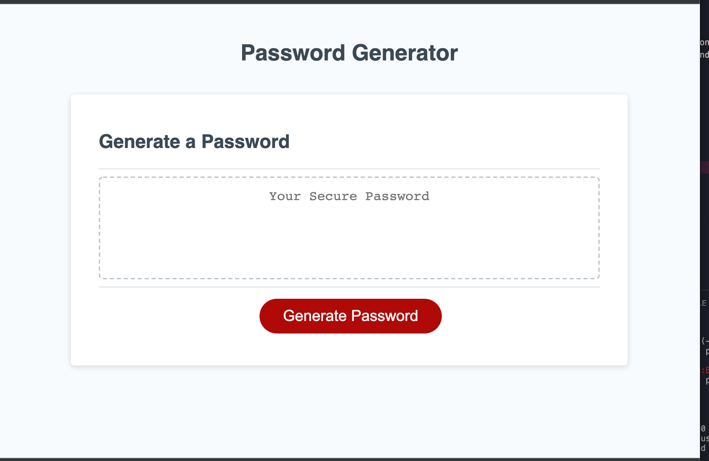

# Password Generator 

# Description

The Password Generator is an application that offers the user an efficient and effective method  to generate a random password that includes:
- 8 to 128 characters
- Upper Case letters
- Lower Case letters
- Numbers

# Generator Display

# Built with
- Javascript
- HTML
- CSS

# Link to deployed site

https://bbaker1989.github.io/PW-Generator/
